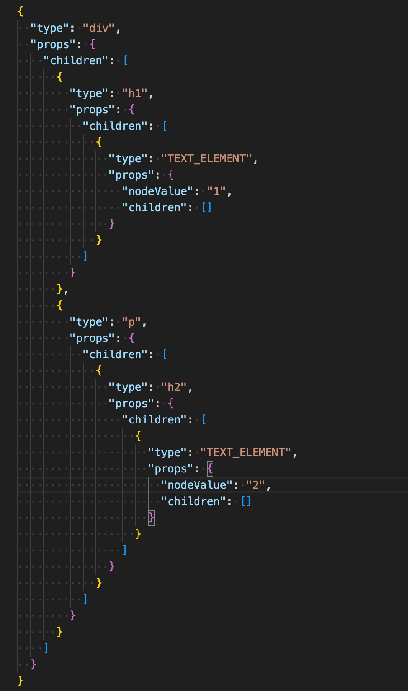
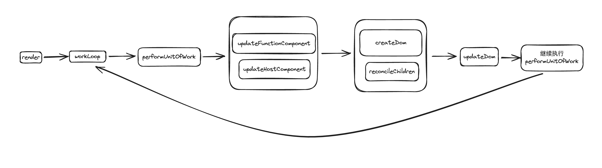
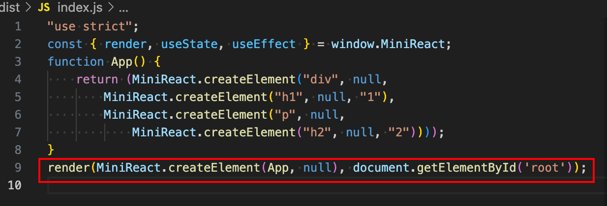
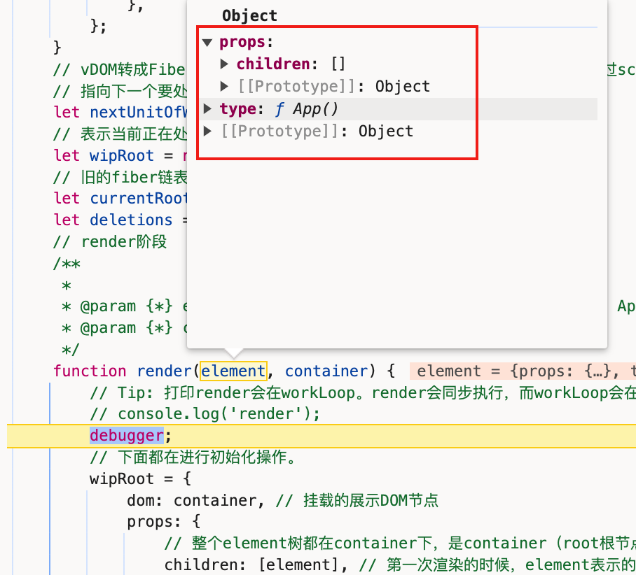
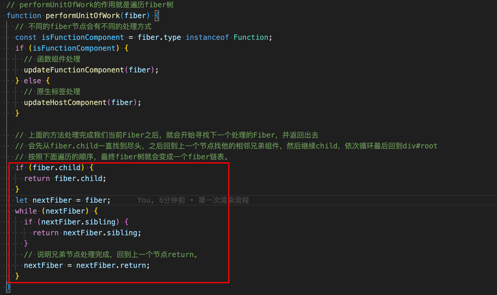
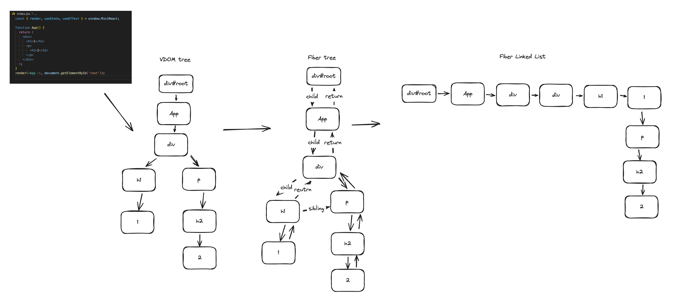

# 手写mini-react

## 1. JSX解析阶段

```jsx
// index.jsx
const { render, useState, useEffect } = window.MiniReact;

function App() {
  return (
    <div>
      <h1>1</h1>
      <p>
        <h2>2</h2>
      </p>
    </div>
  );
}
render(<App />, document.getElementById('root'));

```

通过tsx工具进行编译后：

```jsx
"use strict";
const { render, useState, useEffect } = window.MiniReact;
function App() {
    return (MiniReact.createElement("div", null,
        MiniReact.createElement("h1", null, "1"),
        MiniReact.createElement("p", null,
            MiniReact.createElement("h2", null, "2"))));
}
render(MiniReact.createElement(App, null), document.getElementById('root'));

```

当我们执行App函数，返回的结果就是一个React Element。通过children指向自己的子元素们，最终展现出一个DOM树，即虚拟DOM。



## 2. 第一渲染过程



1. 解析完成后，html引入文件后，会开始执行js代码，执行render函数。
   + render函数主要做了一些初始化的工作。设置wipRoot，并且设置下一个需要处理的fiber节点（nextUnitOfWork）。



```js
/**
   *
   * @param {*} element 第一次渲染的时候，拿到的是根组件的信息，type：App。类型是一个函数。需要执行该函数才能拿到App子组件的信息
   * @param {*} container <div id="root"></div>
   */
  function render(element, container) {
    // Tip: 打印render会在workLoop。render会同步执行，而workLoop会在空闲执行。
    // console.log('render');
    debugger;

    // 下面都在进行初始化操作。
    wipRoot = {
      dom: container, // 挂载的展示DOM节点
      props: {
        children: [element], // 第一次渲染的时候，element表示的就是我们的App组件的React Element
      },
      alternate: currentRoot, // 就的Fiber链表
    };

    deletions = [];

    // 当我们nextUnitOfWork设置值以后。由于workLoop不断执行，当发现nextUnitOfWork有值的时候，会进入遍历。
    nextUnitOfWork = wipRoot;
  }
```

第一次执行的时候，参数element表示的就是`MiniReact.CreateElement(App, null)`返回值，即：



2. 开始执行workLoop，`workLoop`的作用就是为了目的是为了当有发现`nextUnitOfWork`有值的时候，在空闲时间处理它。

```js
// 可以把workLoop看成类似一个递归函数，会反复循环执行。
// 目的是为了当有发现nextUnitOfWork有值的时候，在空闲时间处理它。
  function workLoop(deadline) {
    debugger;
    // console.log('workLoop');
    // 是否暂停。闲置时间足够为false，不暂停。不够为true，暂停
    let shouldYield = false;
    while (nextUnitOfWork && !shouldYield) {
      nextUnitOfWork = performUnitOfWork(nextUnitOfWork);
      // 判断是都暂停
      shouldYield = deadline.timeRemaining() < 1;
    }

    if (!nextUnitOfWork && wipRoot) {
      commitRoot();
    }

    // 递归
    requestIdleCallback(workLoop);
  }
```

3. 进入`performUnitOfWork`，此时我们的`nextUnitOfWork`表示的是根节点`root`，执行`updateHostComponent`，进而执行`reconcileChildren`。

```js
function performUnitOfWork(fiber) {
    debugger;
    const isFunctionComponent = fiber.type instanceof Function;
    if (isFunctionComponent) {
      // 函数组件处理
      updateFunctionComponent(fiber);
    } else {
      // 原生标签处理
      updateHostComponent(fiber);
    }
  
  ......
 }
```

4. `reconcileChildren`的作用就是对当前节点的React Element转变成Fiber。
5. 完成整个虚拟DOM变成Fiber链表后，进入`commitRoot`，继而进入`commitWork`，`commitWork`所做的就是将一个个Fiber会转成真实DOM，一步步将子元素`appendChild`插入父元素，界面一点点渲染出来。

## 2. 为什么最终会形成fiber链表



通过这部份不断遍历节点的child，直到结束后，回到上一个fiber寻找兄弟节点，之后再遍历它的child，通过这样的规律，最终遍历完成整棵树，而我们遍历整个Fiber树的过程，更像一个链表。循环结束的标志是回到了根节点。

